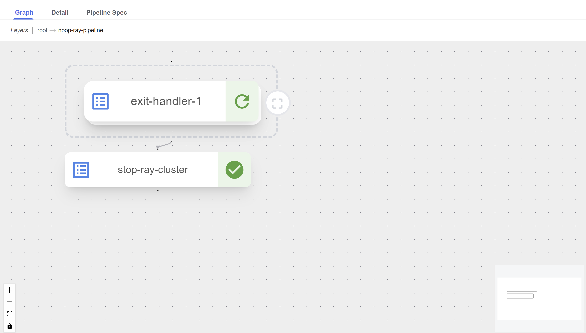
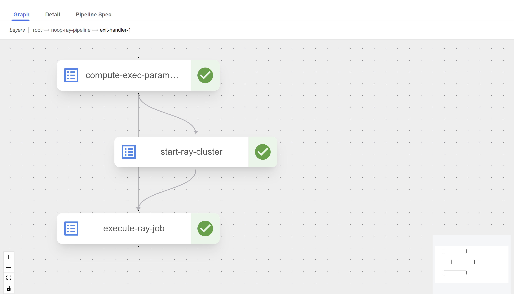
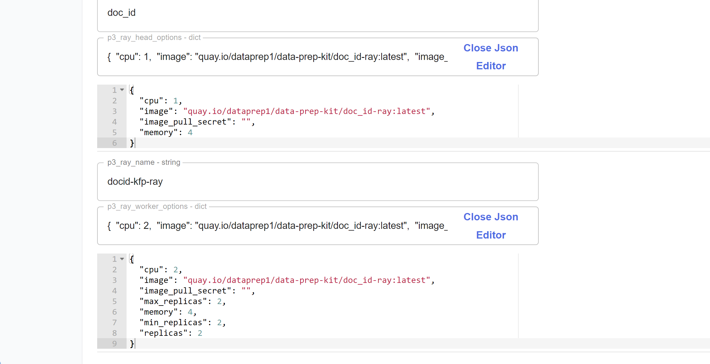

# Chaining transforms using KFP V2

As in [super pipelines of KFP v1](../../../doc/multi_transform_pipeline.md), we want to offer an option of running a series of transforms one after the other on the data. But, in KFP v2 we can make it easier to chain transforms using the [nested pipelines](https://www.kubeflow.org/docs/components/pipelines/user-guides/components/compose-components-into-pipelines/#pipelines-as-components) that KFP v2 offers.

One example of chaining `noop` and `document id` transforms can be found [here](superpipeline_noop_docId_v2.py). When running this pipeline it appears as hierarchical graph with two nested pipelines, one for each transform as shown in the following screenshots.

`root` Layer


`root -> noop-ray-pipeline` Layer


`root -> noop-ray-pipeline -> exit-handler-1` Layer


Another useful feature of the KFP v2 is the `Json` editor for the `dict` type input parameter as shown here:


## Main differences from KFP v1 superpipeline:
- It is not required to upload the transforms pipelines before running the superpipeline.
- It created just one run that includes all the nested transfroms and their sub-tasks.
- No need for additional component as `executeSubWorkflowComponent.yaml`. All the implementation in the same pipeline file.
- One missing thing in this implementation is the overriding parameters option.

### How to compile the superpipeline
```
cd kfp/superworkflows/ray/kfp_v2/
make clean
export KFPv2=1
export PYTHONPATH=../../../../transforms
make workflow-build
```
